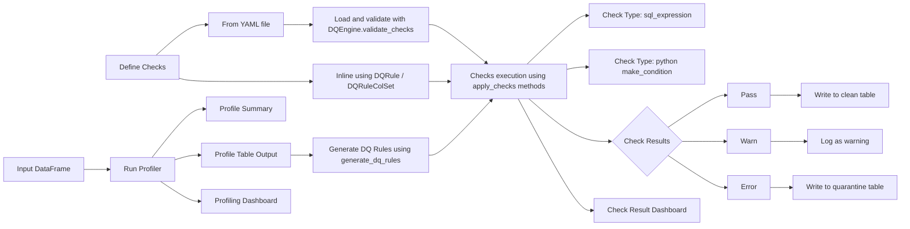

# A Deep Dive into Databricks DQX

## Introduction

In the world of data, having clean, trustworthy information is absolutely crucial, even more so now with all the amazing advancements in Generative AI. Think of your data as the LEGO bricks for building incredible AI masterpieces. Just like a stunning LEGO castle needs perfectly shaped and organized bricks, your cutting-edge AI models – whether they're generating text, images, or insights – demand impeccable data quality.

Without solid, reliable data, even the smartest Gen AI models can produce flawed, biased, or irrelevant outputs. This is where data engineering plays a heroic role. Data engineers are the architects and builders who ensure these data bricks are not just present, but also clean, consistent, and ready for use. If the foundational data is messy or broken, your sophisticated products and AI "buildings" will simply fall apart, no matter how advanced the AI itself is.

That's precisely why Data Quality (DQ) tools are more vital than ever. They act as the rigorous quality control, making sure every piece of data is fit for purpose. Today, we're diving into a rising star in the Databricks ecosystem: **Databricks DQX**. If you're building a modern data platform on the Lakehouse and aiming for truly impactful applications, you'll definitely want to pay attention to this open-source gem built by Databricks Labs.


## What is Databricks DQX? 
 
At its core, **Databricks DQX** (Data Quality eXtensions) is a powerful, open-source library designed specifically for the Databricks Lakehouse Platform. It provides a flexible and extensible framework for defining, measuring, and enforcing data quality rules on your data.

Being **open-source** means a few fantastic things:

* **Transparency:** You can see exactly how it works under the hood. No black boxes here!
* **Flexibility:** It can be adapted and extended to fit your unique data quality needs.
* **Community-Driven:** It benefits from contributions and insights from a global community of data professionals.

This section makes use of a flow diagram / decision tree to explain the various options that DQX has to offer


## The "Databricks Labs" Difference 
Databricks Labs is where Databricks engineers, researchers, and community members innovate and experiment. These projects are bleeding-edge, often exploring new ideas and solutions that might eventually mature into core Databricks product features.

However, a key distinction is customer support. Unlike core Databricks products that come with official, enterprise-grade customer support, Databricks Labs projects like DQX typically don't offer direct customer support. This means:

If you encounter an issue or have a question, you'll primarily rely on the project's GitHub repository for issues, documentation, and potentially community forums.
You won't have the same level of guaranteed SLA or dedicated support channels as you would for, say, Delta Lake or Unity Catalog.
But don't let this be a **showstopper** for adoption! Think about some of the most transformative technologies we use every day. **Android**, the operating system powering billions of smartphones globally, is a prime example of an incredibly powerful and successful open-source project. Its strength comes directly from its massive, collaborative community, continuous innovation, and transparent development – all without a traditional enterprise support model for individual users.

Interested in contributing to this awesome project? Check out the [DQX contributing guide](https://databrickslabs.github.io/dqx/docs/dev/)

## Why Choose DQX Over Other Data Quality Tools?
With a plethora of data quality tools on the market, and the option to build something yourself, why should DQX stand out for your Databricks Lakehouse?

-  **Native Lakehouse Integration**: 

    DQX is built from the ground up to understand and leverage Delta Lake's transactional capabilities, schema enforcement, and time travel. This means your DQ checks are efficient and accurate on your Lakehouse data. Unlike many DQ tools that require data egress or complex connectors to your data lake, DQX runs directly on Apache Spark clusters. This allows it to scale effortlessly with your data volumes, processing petabytes of data without breaking a sweat.

- **Open Source Flexibility & Cost**:

    No Vendor Lock-in. If we need a specific type of data quality check, the open-source nature allows you to extend DQX or contribute your own enhancements.
    While there's an investment in understanding and potentially customizing it, you avoid hefty licensing fees associated with many commercial DQ platforms.

- **Avoiding the **"Build Your Own"** Trap**:

    Many organizations attempt to build custom data quality frameworks. While this offers ultimate control, it often leads to:
    - High Maintenance Overhead: Continuously patching, updating, and extending your custom solution.
    - Reinventing the Wheel: Spending engineering cycles on common DQ patterns that DQX already provides.
    - Lack of Best Practices: Your custom solution might miss industry-standard DQ capabilities unless meticulously designed.
    DQX provides a robust, battle-tested foundation, allowing your team to focus on defining quality rules, not building the DQ engine.


- **Community-Driven Innovation**:

    The Databricks Labs ecosystem attracts bright minds contributing to projects like DQX. This means faster innovation, quicker bug fixes (often community-driven), and a platform that evolves with the needs of real-world data practitioners.


## DQX Installation
You can easily get started with DQX using pip:
- Install in the notebook
```bash
%bash
pip install databricks-dqx
```
- Install on the cluster (can also be included in the init-script)


In either case, be sure to restart the cluster to ensure the package is rightly installed. To install in the workspace as a platform administrator, kindly refer to the official [DQX GitHub repo](https://databrickslabs.github.io/dqx/docs/installation/).


## DQX Implementation 
This ```code-heavy``` section focuses on all things required to get started with DQX
### Imports
This section is for library imports that will resolve once **DQX** is rightly installed
```python
from databricks.labs.dqx.profiler.profiler import DQProfiler
from databricks.labs.dqx.profiler.generator import DQGenerator
from databricks.labs.dqx.profiler.dlt_generator import DQDltGenerator
from databricks.labs.dqx.engine import DQEngine
from databricks.sdk import WorkspaceClient
```
### Building Blocks
* **`ws = WorkspaceClient()`**: Initializes a client to securely interact with your Databricks workspace, allowing DQX components to access and manage data assets.
* **`profiler = DQProfiler(ws)`**: This component is used to generate comprehensive data profiles from your tables, extracting vital statistics and metadata for understanding data characteristics.
* ****`generator = DQGenerator(ws)`****: An intelligent component that automatically suggests and creates a foundational set of data quality rules based on the insights from data profiles.
* **`dlt_generator = DQDltGenerator(ws)`**: This specialized generator is designed to create data quality expectations specifically tailored for integration into Databricks Delta Live Tables (DLT) pipelines.
* **`dq_engine = DQEngine(ws)`**: The central execution component responsible for running all defined data quality checks against your datasets and evaluating their adherence to the specified rules.

#### Profiler
```python
input_df = spark.read.csv("dbfs:/databricks-datasets/flights/departuredelays.csv", header=True, inferSchema=True)
summary_stats, profiles = profiler.profile(input_df, opts={"sample_fraction": 1.0})
print(yaml.safe_dump(summary_stats))
# output
date:
  25%: 1061230
  50%: 1131219
  75%: 1221405
  count: 1000
  count_non_null: 1000
  count_null: 0
  max: 1312358
  mean: 1144525.039
  min: 1010545
  stddev: 91707.91510402036
delay:
  25%: -7
  50%: -4
  75%: 3
  count: 1000
  count_non_null: 1000
  count_null: 0
  max: 489
  mean: 8.41
  min: -26
  stddev: 40.25785134100667
destination:
  25%: null
  50%: null
  75%: null
  count: 1000
  count_non_null: 1000
  count_null: 0
  max: SLC
  mean: null
  min: ATL
  stddev: null
distance:
  25%: 285
  50%: 494
  75%: 602
  count: 1000
  count_non_null: 1000
  count_null: 0
  max: 1586
  mean: 497.194
  min: 137
  stddev: 322.55265085963373
origin:
  25%: null
  50%: null
  75%: null
  count: 1000
  count_non_null: 1000
  count_null: 0
  max: ABQ
  mean: null
  min: ABE
  stddev: null
```

```python
for profile in profiles:
    print('*',profile)
# output
* DQProfile(name='is_not_null', column='date', description=None, parameters=None)
* DQProfile(name='min_max', column='date', description='Real min/max values were used', parameters={'min': 1010545, 'max': 1312358})
* DQProfile(name='is_not_null', column='delay', description=None, parameters=None)
* DQProfile(name='min_max', column='delay', description='Real min value was used. Max was capped by 3 sigmas. avg=8.41, stddev=40.25785134100667, max=489', parameters={'min': -26, 'max': 130})
* DQProfile(name='is_not_null', column='distance', description=None, parameters=None)
* DQProfile(name='min_max', column='distance', description='Real min value was used. Max was capped by 3 sigmas. avg=497.194, stddev=322.55265085963373, max=1586', parameters={'min': 137, 'max': 1465})
* DQProfile(name='is_not_null', column='origin', description=None, parameters=None)
* DQProfile(name='is_in', column='origin', description=None, parameters={'in': ['ABE', 'ABI', 'ABQ']})
* DQProfile(name='is_not_null', column='destination', description=None, parameters=None)
```

#### Generator
```python
checks = generator.generate_dq_rules(profiles)  # with default level "error"
print(yaml.safe_dump(checks))
#output
- check:
    arguments:
      col_name: date
    function: is_not_null
  criticality: error
  name: date_is_null
- check:
    arguments:
      col_name: date
      max_limit: 1312358
      min_limit: 1010545
    function: is_in_range
  criticality: error
  name: date_isnt_in_range
- check:
    arguments:
      col_name: delay
    function: is_not_null
  criticality: error
  name: delay_is_null
- check:
    arguments:
      col_name: delay
      max_limit: 130
      min_limit: -26
    function: is_in_range
  criticality: error
  name: delay_isnt_in_range
- check:
    arguments:
      col_name: distance
    function: is_not_null
  criticality: error
  name: distance_is_null
- check:
    arguments:
      col_name: distance
      max_limit: 1465
      min_limit: 137
    function: is_in_range
  criticality: error
  name: distance_isnt_in_range
- check:
    arguments:
      col_name: origin
    function: is_not_null
  criticality: error
  name: origin_is_null
- check:
    arguments:
      allowed:
      - ABE
      - ABI
      - ABQ
      col_name: origin
    function: is_in_list
  criticality: error
  name: origin_other_value
- check:
    arguments:
      col_name: destination
    function: is_not_null
  criticality: error
  name: destination_is_null
```

#### DLT Generator
```python
dlt_expectations = dlt_generator.generate_dlt_rules(profiles, language="SQL")
dlt_expectations = dlt_generator.generate_dlt_rules(profiles, language="Python")
dlt_expectations = dlt_generator.generate_dlt_rules(profiles, language="Python_Dict")
print(dlt_expectations)
print(dlt_expectations)
print(dlt_expectations)
#output
['CONSTRAINT date_is_not_null EXPECT (date is not null)', 'CONSTRAINT date_min_max EXPECT (date >= 1010545 and date <= 1312358)', 'CONSTRAINT delay_is_not_null EXPECT (delay is not null)', 'CONSTRAINT delay_min_max EXPECT (delay >= -26 and delay <= 130)', 'CONSTRAINT distance_is_not_null EXPECT (distance is not null)', 'CONSTRAINT distance_min_max EXPECT (distance >= 137 and distance <= 1465)', 'CONSTRAINT origin_is_not_null EXPECT (origin is not null)', "CONSTRAINT origin_is_in EXPECT (origin in ('ABE', 'ABI', 'ABQ'))", 'CONSTRAINT destination_is_not_null EXPECT (destination is not null)']
@dlt.expect_all(
{"date_is_not_null": "date is not null", "date_min_max": "date >= 1010545 and date <= 1312358", "delay_is_not_null": "delay is not null", "delay_min_max": "delay >= -26 and delay <= 130", "distance_is_not_null": "distance is not null", "distance_min_max": "distance >= 137 and distance <= 1465", "origin_is_not_null": "origin is not null", "origin_is_in": "origin in ('ABE', 'ABI', 'ABQ')", "destination_is_not_null": "destination is not null"}
)
{'date_is_not_null': 'date is not null', 'date_min_max': 'date >= 1010545 and date <= 1312358', 'delay_is_not_null': 'delay is not null', 'delay_min_max': 'delay >= -26 and delay <= 130', 'distance_is_not_null': 'distance is not null', 'distance_min_max': 'distance >= 137 and distance <= 1465', 'origin_is_not_null': 'origin is not null', 'origin_is_in': "origin in ('ABE', 'ABI', 'ABQ')", 'destination_is_not_null': 'destination is not null'}
```

#### Engine - Custom Checks
We can provide our own custom checks from a separate config file which is subjected to its own validation first for syntax and then can be applied on the dataframe
```python
with open( "custom_dqx_rules.yaml", "r") as file:
    check_dict = yaml.safe_load(file)

dq_engine = DQEngine(spark)
validation_result = dq_engine.validate_checks(check_dict)

assert not validation_result.has_errors, f"Validation failed: {validation_result.errors}"

silver_df, quarantine_df = dq_engine.apply_checks_by_metadata_and_split(input_df, check_dict)
```
There are various methods that DQX provides for finally applying the checks and they can be found here - 
 
A subset of the checks that dqx currently supports


## DQX Inbuilt Methods
There are many purpose specific methods that DQX has when we import it, the entire list and source code is present [here](https://github.com/databrickslabs/dqx/blob/main/src/databricks/labs/dqx/engine.py)
## Conclusion
Databricks DQX, as an open-source Databricks Labs project, offers a compelling solution for data quality within your Lakehouse. While it comes with the "Labs" caveat of community-driven support, its native integration with Delta Lake and Spark, combined with the power and flexibility of open source, makes it a strong contender against commercial tools and a smarter choice than building entirely custom solutions. Embrace DQX to build trust in your data and unlock its full potential!

## References
-  https://databrickslabs.github.io/dqx/ 
- https://github.com/databrickslabs/dqx/tree/main